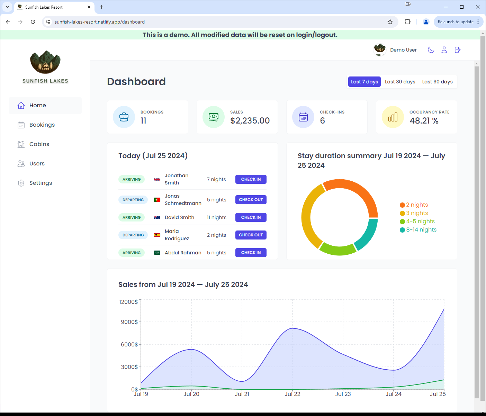
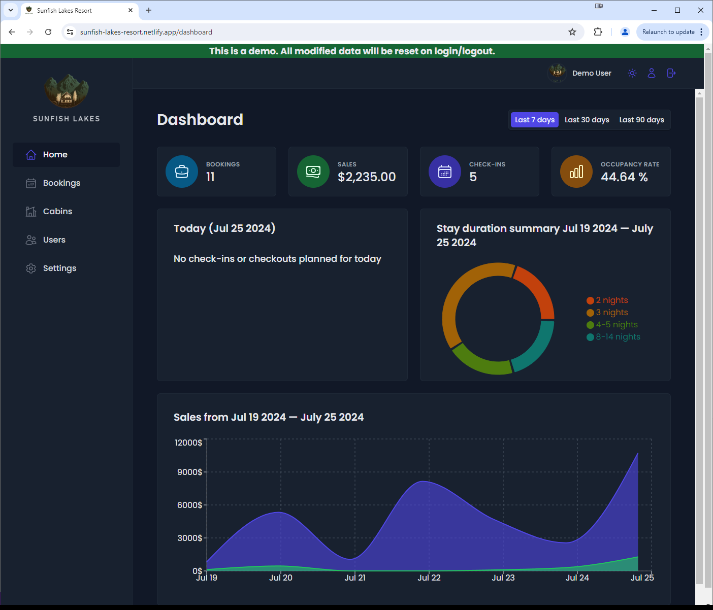
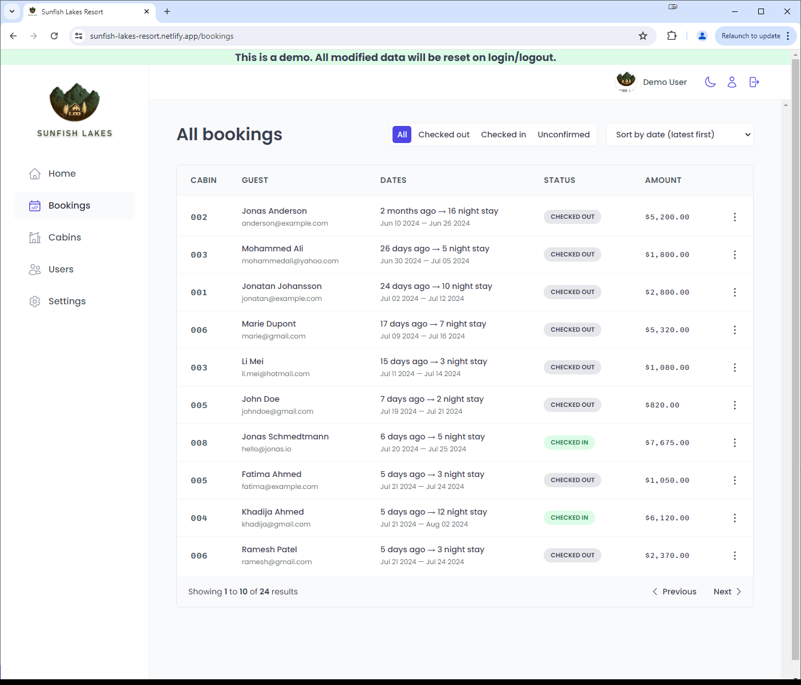
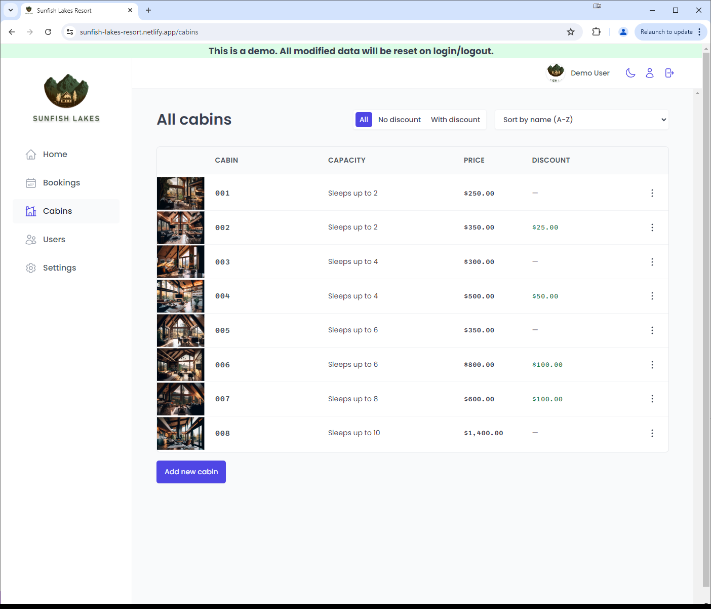

# Sunfish Lakes

A React web app using
- React Query
- React Hook Form
- Styled Components
- with a Supabase backend
    - signup using email confirmation
    - authentication
    - managed Postgres with Row Level Security policies

for managing reservations at a fictional resort.

Demonstrates fluency in React features (e.g. React Context and React Portal) and professional practices (advanced use of the compound component pattern and the render props pattern).

### Try it out!
- deployed on Vercel with CI at https://sunfish-lakes-resort.vercel.app/
- deployed on Netlify at https://sunfish-lakes-resort.netlify.app/

